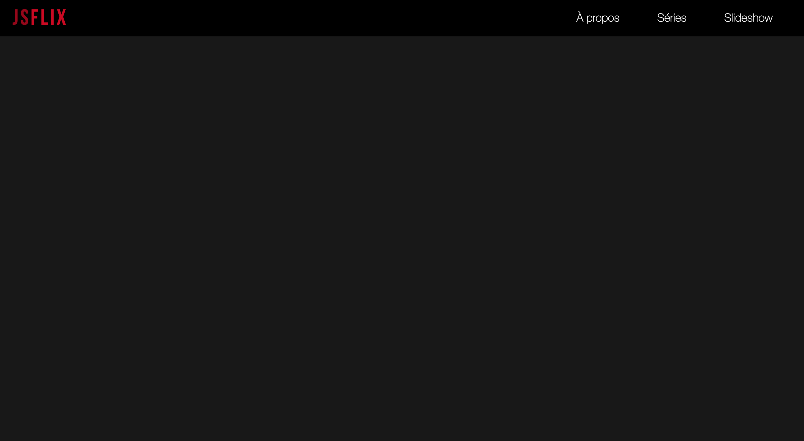
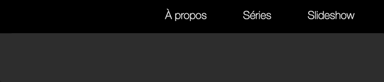
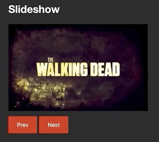

# Contrôle TP JS - 2019-2020

## Objectif
Votre objectif dans cet exercice est de coder une [Single Page App](https://en.wikipedia.org/wiki/Single-page_application).

## Points de vigilance et modalités de rendu
Votre rendu devra se faire via un repository gitlab à votre nom dans le dossier de votre groupe (cf. instructions plus bas). Vous devez commit et push à chaque exercice. Les logs serviront à la notation.

Une attention particulière sera portée à la propreté du code qui sera remis :
- nommage des variables, fonctions et méthodes
- respect maximum des règles de [clean code](https://gitlab.univ-lille.fr/2019-coa-tdd/tp1#rappel-des-r%C3%A8gles-de-clean-code-vue-pendant-le-tp) :
	- pas de fonction/méthode de plus de 10 lignes
	- nommage correct des variables et des méthodes : on comprend à quoi elles servent à la lecture et il n'y a pas d'abréviation.
	- pas plus de 3 indentations par fonction/méthode
	- pas de classe de plus de 50 lignes
	- pas de commentaire, on comprend le code à la première lecture
	- pas de répétition (DRY)
	- le code est le plus simple possible : si je peux enlever du code sans casser la fonctionnalité c'est que je n'ai pas fini ma simplification
	- Pas de "magic numbers", des nombre ou des Strings qui sortent de nulle part.
	- Max 2 paramètres par fonction/méthode

Le code doit par ailleurs être exempt de bugs et codé en ES6+. **L'utilisation de jQuery est autorisée mais pas indispensable**.

## Préparatifs
Pour cet exercice un ensemble de fichiers de base vous sont fournis :
- un fichier `index.html` et des dossiers `./css` et `./images` contenant l'interface de l'application
- des fichiers de configuration pour Babel et Webpack prêts à l'emploi (les commandes `npm run build` et `npm run watch` sont fonctionnelles)
- un fichier `js/main.js` vide qui correspond au point d'entrée de l'application.


1. Vérifiez que vous avez bien un repository gitlab créé par le professeur pour ce CTP dans votre groupe de TP :
	- https://gitlab.univ-lille.fr/js/groupe-fc
	- https://gitlab.univ-lille.fr/js/groupe-g
	- https://gitlab.univ-lille.fr/js/groupe-h
	- https://gitlab.univ-lille.fr/js/groupe-i
	- https://gitlab.univ-lille.fr/js/groupe-j

2. Clonez le projet
	```bash
	mkdir -p ~/ws-js/ctp-2020
	git clone https://gitlab.univ-lille.fr/js/ctp-2020.git ~/ws-js/ctp-2020
	```
3. Changez l'URL du projet gitlab pour y mettre celle de votre projet gitlab personnel (créé par le professeur) :
	```bash
	cd ~/ws-js/ctp-2020
	git remote set-url origin URL-DE-VOTRE-PROJET-GITLAB
	```
4. Lancez VSCodium :
	```bash
	codium ~/ws-js/ctp-2020
	```
5. Ouvrez un terminal intégré dans VSCodium à l'aide du raccourci <kbd>CTRL</kbd>+<kbd>J</kbd> et tapez :
	```bash
	npm install
	```
6. Une fois tout installé, lancez la compilation :
	```bash
	npm run watch
	```
7. Dans un second terminal intégré, lancez un serveur http :
	```
	npx serve -l 8000
	```
8. Enfin, vérifiez ensuite que la page s'affiche correctement dans le navigateur en ouvrant http://localhost:8000/. Le résultat attendu est le suivant :

<a href="images/readme/screen1.png"></a>


## Exercice 1 : Menu de navigation

Rappel : vous devez commit et push à chaque exercice. Les logs serviront à la notation.

La page `index.html` contient un menu de navigation :
```html
<ul class="mainMenu">
	<li><a id="about" href="#">À propos</a></li>
	<li><a id="series" href="#">Séries</a></li>
	<li><a id="slideshow" href="#">Slideshow</a></li>
</ul>
```

1. **Au clic sur les liens du menu, faire en sorte que le lien sur lequel l'utilisateur a cliqué obtienne la classe CSS "selected".**

	Par exemple si l'utilisateur clique sur le lien **"Séries"**, alors le code HTML du lien devient :

	```html
	<a id="series" href="#" class="selected">Séries</a>
	```

	N'oubliez pas de commit/push à chaque exercice.

2. **Un seul lien à la fois peut avoir la classe selected"**, c'est à dire que lorsque l'utilisateur clique sur un lien, le précédent lien actif perd la classe "selected".

<a href="images/readme/menu.gif"></a>


## Exercice 2 : affichage du contenu
La page HTML contient 3 sections qui sont masquées en CSS :
```html
<section class="aboutContainer">...</section>
<section class="seriesContainer">...</section>
<section class="slideshowContainer">...</section>
```
1. **Faites en sorte que ces sections s'affichent lorsque l'utilisateur clique sur le lien du menu correspondant** ("A propos" -> `aboutContainer`, "Séries" -> `seriesContainer`, etc.).

	NB: les sections sont par défaut masquées à l'aide de la règle CSS `display: none`, vous pouvez donc vous servir de l'attribut HTML `style` pour afficher une balise :
	```html
	<section class="seriesContainer" style="display:initial">...</section>
	```

2. **Faites en sorte que seule la dernière section cliquée soit visible** lorsqu'on clique sur un lien du menu.

3. **Au chargement de la page, faites en sorte que la section "slideshowContainer" soit affichée par défaut** et que son menu soit sélectionné.

## Exercice 3 : classe Slideshow

1. **Créez une classe `Slideshow` dans un fichier `js/Slideshow.js`. Cette classe s'utilisera dans le `main.js` comme ceci** :
	```js
	const images = 'twd,got,td',
		element = document.querySelector('.slideshowContainer .slideshow');

	const s = new Slideshow(images, element);
	```
	- le premier paramètre du constructeur est une chaîne de caractères qui contient des noms d'images, séparés par des virgules (regardez le dossier `/images`, il contient 3 fichiers : `twd.gif`, `got.gif` et `td.gif`, la chaîne de caractères passée est donc 'twd,got,td')
	- le second paramètre du constructeur est un élément HTML de la page dans laquelle le slideshow doit se rendre. (*NB: l'élément passé dans l'exemple ci-dessus permet d'avoir un affichage correct grâce aux CSS fournies, mais en théorie, le code doit fonctionner avec n'importe quel élément HTML*).
	- Par défaut, le slideshow affiche la première image de la liste sous cette forme :
		```html
		<a href="images/twd.gif">
			
		</a>
		```

2. **Ajoutez à la classe `Slideshow` deux méthodes `.next()` et `.prev()` qui permettent de changer l'image affichée dans la page.** Ces méthodes devront être déclenchées au clic sur les boutons "Next" et "Prev" contenus dans la balise `slideshowContainer`.
   Par exemple, si l'on clique sur le bouton "Next" une seule fois, alors le code HTML devient

	```html
	<a href="images/got.gif">
		
	</a>
	```

	NB: Une fois arrivé à la fin de la liste, l'appui sur le bouton "Next" doit "boucler" au début et réafficher la première image. Idem si l'on est sur la première image et que l'on clique sur "Prev".

<a href="images/readme/slideshow.gif"></a>


