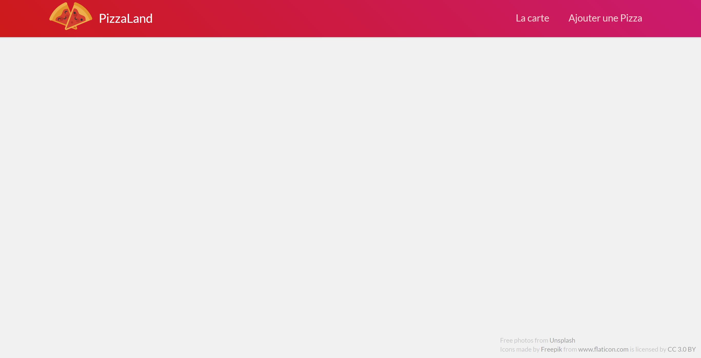

# TP 1 : A. Préparatifs <!-- omit in toc -->

## Sommaire <!-- omit in toc -->
- [A.1. Configuration du projet](#a1-configuration-du-projet)
- [A.2. Lancement serveur HTTP](#a2-lancement-serveur-http)
- [A.3. Installation IDE](#a3-installation-ide)

## A.1. Configuration du projet
1. **Clonez ce repo dans un dossier de votre choix :**
	```bash
	mkdir ~/ws-js
	git clone https://gitlab.univ-lille.fr/js/tp1.git ~/ws-js/tp1
	```

## A.2. Lancement serveur HTTP

2. **Lancez un serveur http dans le dossier du TP**.

	Pour consulter notre appli web dans un navigateur, il nous faut un serveur http. On pourrait, pour cet exercice, utiliser n'importe quel serveur http (apache, tomcat, etc.) mais je vous propose d'utiliser Node.JS (déjà installé sur les machines des salles de TP) et 2 utilitaires qui fournis avec : [npm (Node Package Manager)](https://fr.wikipedia.org/wiki/Npm) et [npx](https://www.npmjs.com/package/npx).

	***NB**: Si vous utilisez votre propre machine, installez la dernière version de Node : https://nodejs.org/en/download/current/*

	1. **Pour commencer, configurez le proxy :**
		```bash
		npm config set proxy http://cache.univ-lille1.fr:3128
		```

	2. **Lancez un serveur http avec npx** :
		```bash
		cd ~/ws-js/tp1
		npx serve -l 8000
		```
		Node télécharge alors le paquet "serve" puis le lance dans le dossier tp1. Node se met alors en attente de connexions http et affiche quelque chose comme ceci :

		


3. **Vérifiez dans votre navigateur que la page index.html** (fournie dans ce repo) **s'affiche correctement** en ouvrant l'url http://localhost:8000. Le résultat attendu est le suivant : <br><a href="images/readme/pizzaland-00.jpg"></a>

	*Si la page ne s'affiche pas correctement, vérifiez que vous avez bien lancé votre serveur Node avec npx dans le bon dossier (c'est à dire celui où se trouve le fichier `index.html`).*

## A.3. Installation IDE

4. **Installez un éditeur de code optimisé pour le développement web et particulièrement le JS moderne**. L'un des éditeurs les plus populaires actuellement est [Visual Studio Code](https://code.visualstudio.com/) (vscode). C'est un éditeur opensource et développé avec [Electron](https://electronjs.org/), c'est donc un outil qui est lui-même développé en JS !

	Malheureusement des questions de licence liées à Microsoft [plus ou moins obscures](https://vscodium.com/#why) viennent ternir un peu le tableau. Je vous conseille donc d'utiliser la distribution "vraiment opensource" du logiciel qu'est **[VSCodium](https://vscodium.com/)** :

	**Pour l'installer sur Linux en mode portable (sans les droits d'admin) :**
	- téléchargez la version **"linux x64"** disponible sur https://github.com/VSCodium/vscodium/releases/latest
	- décompressez-la dans le dossier de votre choix,
	- créez un sous-dossier nommé `"data"` et `"data/tmp"` dans le répertoire de vscodium puis ajoutez le dossier `"bin"` à votre path :
		```bash
		cd chemin/vers/vscodium
		mkdir -p data/tmp
		export PATH=$PATH:$(pwd)/bin
		```
	- vous pouvez maintenant ouvrir VSCodium dans le dossier de votre projet :
		```bash
		cd ~/ws-js/tp1
		codium .
		```

	**Les 3 raccourcis clavier à connaître :**
	- <kbd>CTRL</kbd>+<kbd>P</kbd> : ouvrir un fichier à partir de son nom
	- <kbd>CTRL</kbd>+<kbd>SHIFT</kbd>+<kbd>P</kbd> : lancer n'importe quelle commande des menus.
	- <kbd>CTRL</kbd>+<kbd>/</kbd> : commenter/décommenter
	- cheat sheet linux : https://code.visualstudio.com/shortcuts/keyboard-shortcuts-linux.pdf

## Étape suivante <!-- omit in toc -->
Si tout fonctionne, vous pouvez passer à l'étape suivante : [B. Intégration du JS](B-integration.md)