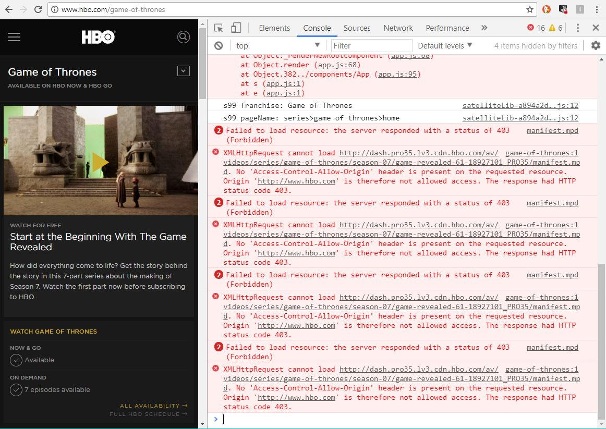
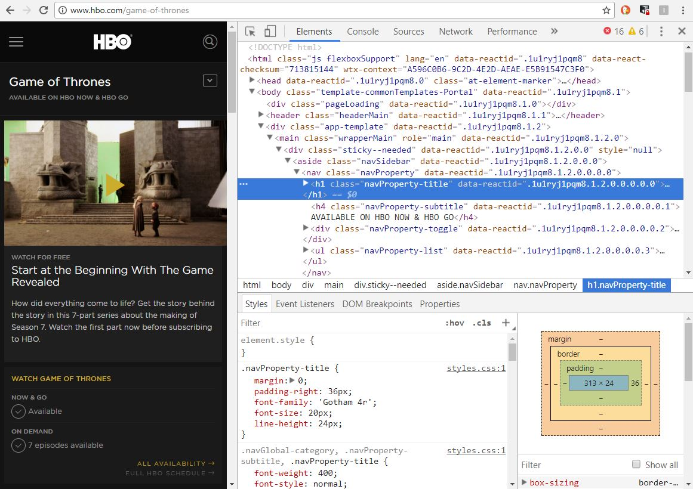
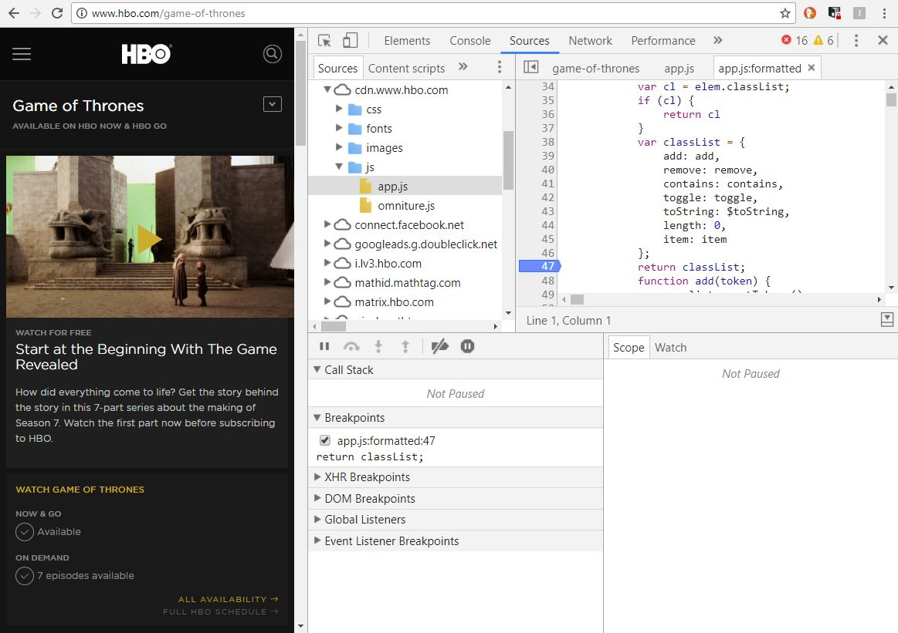

# TP 1 : C. les devtools <!-- omit in toc -->

## Sommaire <!-- omit in toc -->
- [B.1. devtools : La console](#b1-devtools--la-console)
- [B.2. devtools : l'inspecteur d'éléments](#b2-devtools--linspecteur-déléments)
- [B.3. devtools : l'onglet Sources](#b3-devtools--longlet-sources)


***Lorsque l'on développe en JS, les outils de debug dont on dispose nous sont fournis par le navigateur. Tous les navigateurs (même Internet Explorer...) disposent d'outils de développement. Sur Chrome, pour les afficher c'est donc, comme vu plus haut, la touche <kbd>F12</kbd>. On peut également les afficher en faisant un clic droit dans la page et en cliquant sur "Inspecter l'élément".***

**Pendant les TP gardez <u>toujours</u> les outils de développement (et notamment la console) ouverts, ça vous sauvera la vie.**

## B.1. devtools : La console
La console sert à afficher les instructions `console.log()` mais aussi les erreurs éventuelles dans votre code (vous me direz que ce n'est pas la peine, que vous ne faites jamais d'erreur, mais on sait tous les deux que c'est un mensonge, *"n'est-ce pas ?"*).



La méthode `console.log()` peut recevoir plusieurs paramètres, ils seront dans ce cas affichés les un après les autres, séparés par un espace. Remplacer le `console.log(...);` du `main.js` par :
```js
console.log('Welcome to ', {title:'PizzaLand', emoji: '🍕'});
```

L'objet `console` est un objet global qui contient la méthode `.log()` mais aussi d'autres méthodes qui permettent d'avoir un rendu différent et de filtrer les messages. Essayez les méthodes suivantes et constatez le résultat dans la console :
- console.warn()
- console.error()
- console.clear()

Enfin, la console permet de tester rapidement du code JS grâce à un champ de saisie. Tapez-y l'instruction `42+"12"-10` puis tapez <kbd>Entrée</kbd>. Incroyable !

## B.2. devtools : l'inspecteur d'éléments

L'inspecteur d'éléments permet de consulter ET de manipuler le code HTML et CSS de la page.



Il sera utile pour vérifier que le code HTML que va générer votre JS correspond bien à ce qui est attendu.

## B.3. devtools : l'onglet Sources
L'onglet sources permet d'inspecter le code JavaScript de la page, de placer des breakpoints et de stopper l'exécution du code quand une erreur survient. Quand l'exécution du JS est stoppée, on peut consulter les valeurs des variables locales et globales, de voir la call-stack, etc.

C'est probablement l'onglet des devtools le plus important lorsqu'on développe en JavaScript.



Pour l'utiliser, remplacez le contenu de votre fichier `main.js` en ajoutant le code suivant :
```js
let what = 'door';
console.log('Hold', 'the', what );
```
Rechargez la page, dans l'onglet "Sources" sélectionnez le fichier main.js (dans le panneau de gauche), puis cliquez sur le numéro de la 2e ligne. Une flèche bleue a du s'ajouter ce qui signifie qu'un breakpoint a été ajouté. Comme le code en question s'est déjà exécuté (puisque notre JS se lance au chargement de la page), rechargez la page pour que le breakpoint se déclenche.

Une fois la page rechargée, l'exécution est interrompue, et il est possible de voir à droite, dans l'onglet "Scope" les valeurs des variables locales et notamment de la variable `what`. Vous pouvez aussi consulter la valeur des variables au survol de la variable directement dans le code !

Pour reprendre l'exécution de la page, cliquez sur le bouton play bleu, puis re-cliquez sur le numéro de la 2e ligne pour enlever le breakpoint.

## Étape suivante <!-- omit in toc -->
Si tout fonctionne, vous pouvez passer à l'étape suivante : [D. Les chaînes de caractères](D-chaines.md)