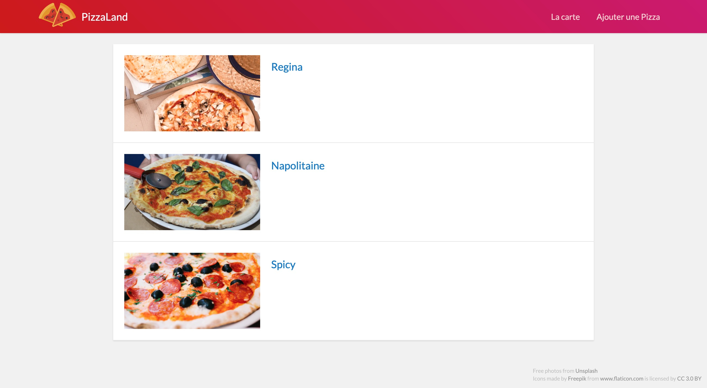
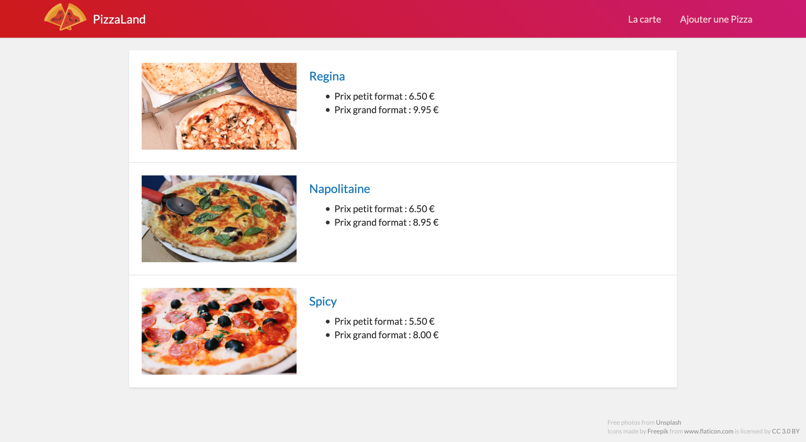

# TP 1 : E. Les tableaux et les objets littéraux <!-- omit in toc -->

## Sommaire <!-- omit in toc -->
- [E.1. Manipulation des tableaux](#e1-manipulation-des-tableaux)
- [E.2. Les Objets littéraux](#e2-les-objets-littéraux)

## E.1. Manipulation des tableaux

Initialisez un tableau nommé `data` avec 3 chaines de caractères : 'Regina', 'Napolitaine', 'Spicy'. Parcourez ce tableau afin de générer 3 liens sur le modèle de celui réalisé plus haut.

Utilisez pour cela les différentes méthodes de parcours des tableaux :
1. Une boucle `for` classique
2. La méthode `Array.forEach` cf. https://developer.mozilla.org/fr/docs/Web/JavaScript/Reference/Objets_globaux/Array/forEach
3. la méthode `Array.map` cf. https://developer.mozilla.org/fr/docs/Web/JavaScript/Reference/Objets_globaux/Array/map accompagnée de la méthode `Array.join` cf. https://developer.mozilla.org/fr/docs/Web/JavaScript/Reference/Objets_globaux/Array/join
4. la méthode `Array.reduce` cf. https://developer.mozilla.org/fr/docs/Web/JavaScript/Reference/Objets_globaux/Array/reduce

*NB: pour `forEach`, `map` et surtout `reduce` pensez à utiliser les arrow functions !*

Le résultat obtenu sera identique dans les 4 cas :
<a href="images/readme/pizzaland-03.jpg"></a>

## E.2. Les Objets littéraux
Modifiez le tableau `data` : au lieu de 3 chaînes de caractères, on va maintenant y mettre 3 objets littéraux :

Première pizza :
```js
{
	nom: 'Regina',
	base: 'tomate',
	prix_petite: 6.5,
	prix_grande: 9.95,
	image: 'https://images.unsplash.com/photo-1532246420286-127bcd803104?fit=crop&w=500&h=300'
}
```

Deuxième pizza :
```js
{
	nom: 'Napolitaine',
	base: 'tomate',
	prix_petite: 6.5,
	prix_grande: 8.95,
	image: 'https://images.unsplash.com/photo-1562707666-0ef112b353e0?&fit=crop&w=500&h=300'
}
```

Troisième pizza :
```js
{
	nom: 'Spicy',
	base: 'crème',
	prix_petite: 5.5,
	prix_grande: 8,
	image: 'https://images.unsplash.com/photo-1458642849426-cfb724f15ef7?fit=crop&w=500&h=300',
}
```

Modifiez la boucle pour générer un code de ce type :
```html
<article class="media">
	<a href="https://images.unsplash.com/photo-1532246420286-127bcd803104?fit=crop&w=500&h=300">
		
		<section class="infos">
			<h4>Regina</h4>
			<ul>
				<li>Prix petit format : 5.50 €</li>
				<li>Prix grand format : 7.50 €</li>
			</ul>
		</section>
	</a>
</article>
```

Le rendu final devra correspondre à ceci :

<a href="images/readme/pizzaland-04.jpg"></a>

***Attention au formatage des prix** (examinez bien la capture d'écran) !*

## Étape suivante <!-- omit in toc -->
Si tout fonctionne, vous pouvez passer à l'étape suivante : [F. Compiler avec Babel](./F-babel.md)