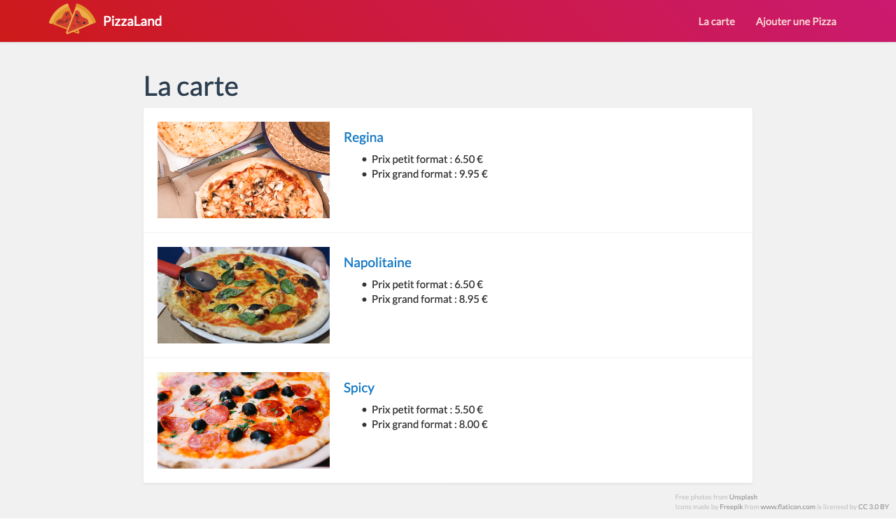
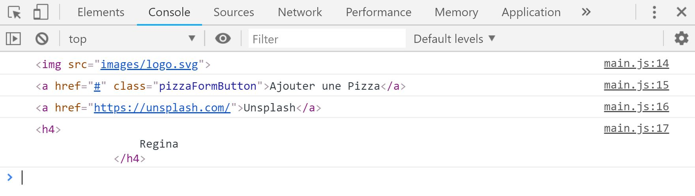
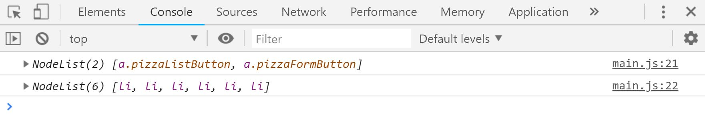
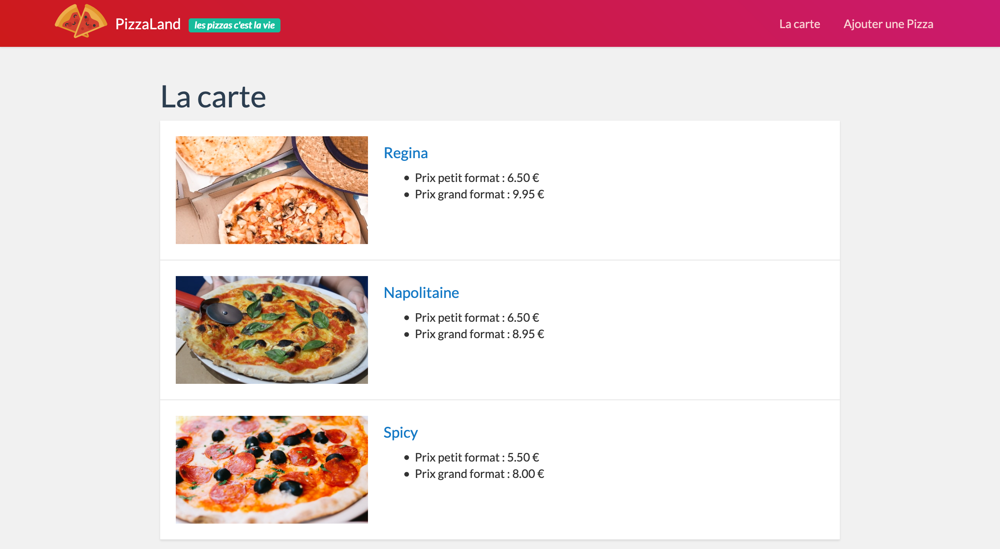
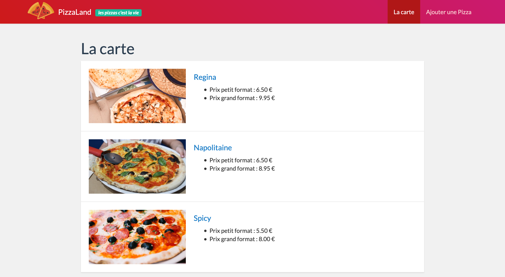

#### TP3 - API DOM <!-- omit in toc -->
# A. Les bases de l'API DOM <!-- omit in toc -->

## Sommaire <!-- omit in toc -->
- [A.1. Configuration du projet](#a1-configuration-du-projet)
- [A.2. Sélectionner des éléments](#a2-sélectionner-des-éléments)
	- [A.2.1. querySelector()](#a21-queryselector)
	- [A.2.2. querySelectorAll()](#a22-queryselectorall)
- [A.3. Modifier des éléments](#a3-modifier-des-éléments)
	- [A.3.1. innerHTML](#a31-innerhtml)
	- [A.3.2. getAttribute/setAttribute](#a32-getattributesetattribute)
- [Étape suivante](#Étape-suivante)

***Ce TP va permettre de mettre en oeuvre les principales méthodes de sélection et de modification d'éléments de l'arbre DOM.***

## A.1. Configuration du projet

**Ce repo contient une solution commentée du précédent TP. Il servira de base au T3 :**

1. Clonez le projet
	```bash
	mkdir -p ~/ws-js/tp3
	git clone https://gitlab.univ-lille.fr/js/tp3.git ~/ws-js/tp3
	```
2. Lancez VSCodium :
	```bash
	codium ~/ws-js/tp3
	```
3. Ouvrez un terminal intégré dans VSCodium à l'aide du raccourci <kbd>CTRL</kbd>+<kbd>J</kbd> et installez les dépendances du projet :
	```bash
	npm install
	```
4. **Une fois tout installé, vous pouvez relancer la compilation à l'aide de la commande `npm run watch` et lancer le serveur http avec `npx serve -l 8000`**. Vérifiez ensuite que la page s'affiche correctement dans le navigateur :<br><a href="images/readme/pizzaland-05.png"></a>

## A.2. Sélectionner des éléments

### A.2.1. querySelector()
Comme vu en cours, la principale méthode pour sélectionner un élément de la page HTML est la méthode `querySelector()`.

querySelector() est une méthode de la classe `Element` qui permet de retourner une référence vers un élément de la page (une balise) à partir d'un sélecteur CSS. Par exemple :
```js
document.querySelector('#appContainer');
```
retourne la balise d'id html 'appContainer' :
```html
<main id="appContainer">
```

Dans le fichier `main.js`, utilisez la fonction `console.log()` et la méthode `querySelector` pour afficher la balise qui a comme classe `"pageTitle"` comme ceci :
```js
console.log( document.querySelector('.pageTitle') );
```

Sur le même modèle, affichez dans la console  :
1. La balise `` qui contient le logo de la page (les 2 parts de pizza)
2. Le lien du menu "Ajouter une pizza"
3. Le lien vers le site [Unsplash](https://unsplash.com/) dans les crédits
4. le titre de la première pizza (*`<h4>Regina</h4>`*)

<a href="images/readme/queryselector-console.jpg"></a>

### A.2.2. querySelectorAll()
La méthode `querySelectorAll()` permet de récupérer non pas un, mais tous les éléments qui correspondent au sélecteur CSS passé en paramètre.

Affichez dans la console :
1. la liste des liens du menu de navigation ("La carte" et "Ajouter une pizza")
2. la liste des prix de toutes les pizzas de la page

<a href="images/readme/queryselectorall-console.jpg"></a>

## A.3. Modifier des éléments
### A.3.1. innerHTML
La propriété `innerHTML` permet à la fois de lire et de modifier le contenu d'un Element HTML (le contenu HTML compris entre les balises ouvrantes et fermantes)

1. Affichez dans la console le titre de la deuxième pizza (*"Napolitaine"*)
2. Remplacez dans la page le titre de la deuxième pizza par *"Savoyarde"*
3. Ajoutez au titre de la page le code HTML suivant :
	```html
	<small class="label label-success">les pizzas c'est la vie</small>
	```

<a href="images/readme/pizzaland-innerhtml.png"></a>

### A.3.2. getAttribute/setAttribute
Les méthodes `getAttribute()` et `setAttribute()` de la classe Element permettent de lire, d'ajouter ou de modifier des attributs HTML.

1. Affichez dans la console l'url du 2e lien contenu dans le footer (`"https://www.freepik.com/"`)
2. Ajoutez la classe CSS "active" au premier `<li>` du menu

<a href="images/readme/pizzaland-setattribute.png"></a>

## Étape suivante
Maintenant que l'on est capable de sélectionner / modifier des éléments HTML, nous allons voir dans le prochain exercice comment détecter les événements : [B. Les événements](./B-evenements.md).